# JavaRecursion
This is lab project of my Data Structures and Algorithms CMP-233 at the County College of Morris. Done in Java!

Professor : Colleen Bamford 

Author : Favio Valentiino Jasso 

Course : Data Structures and Algorithms - CMP-233

The first objective is to solve the piecewise functions on paper before proceeding to create a Java program which follows and solves the same problem logic. Giving matching answers to the ones you solve for on paper. 

<h2>Output Result of Java program</h2>

<h2>Original Problems and Math done</h2>

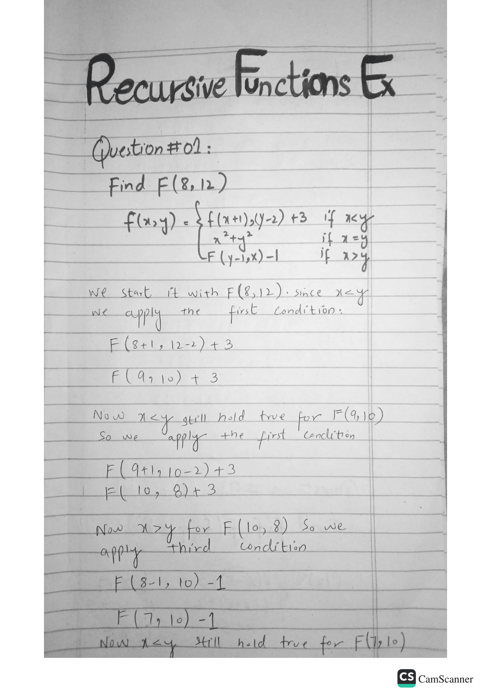
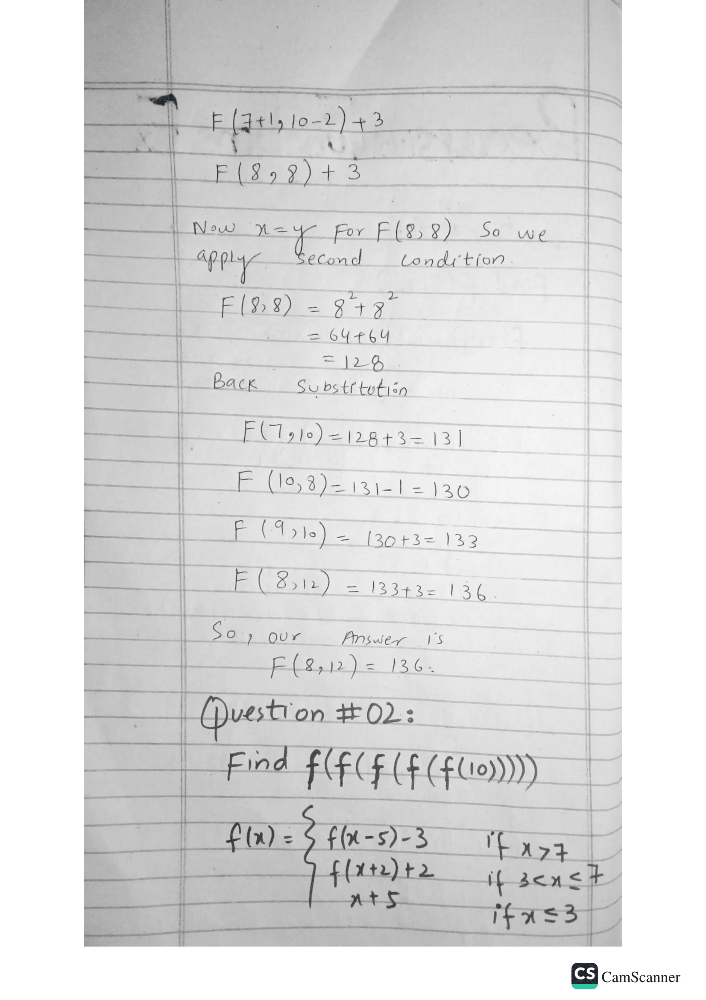
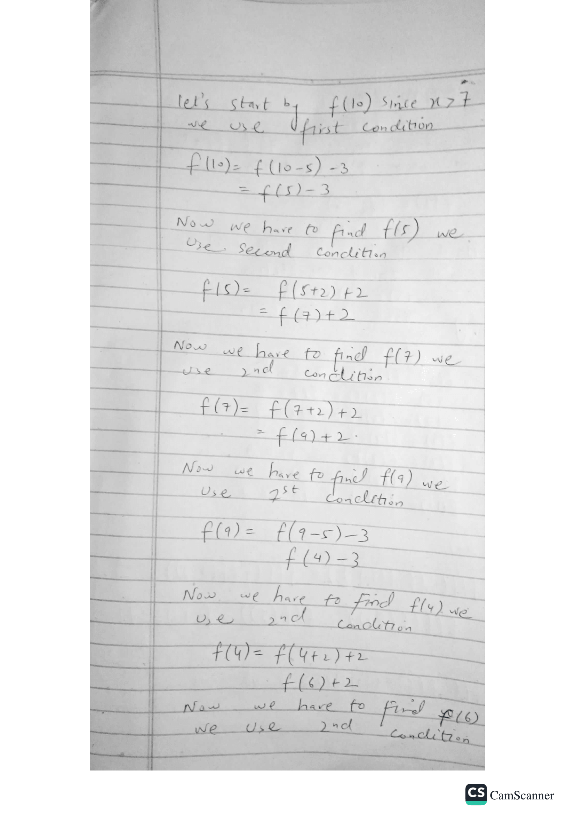
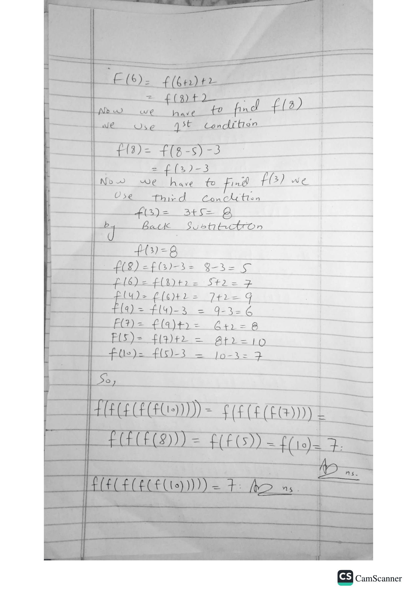

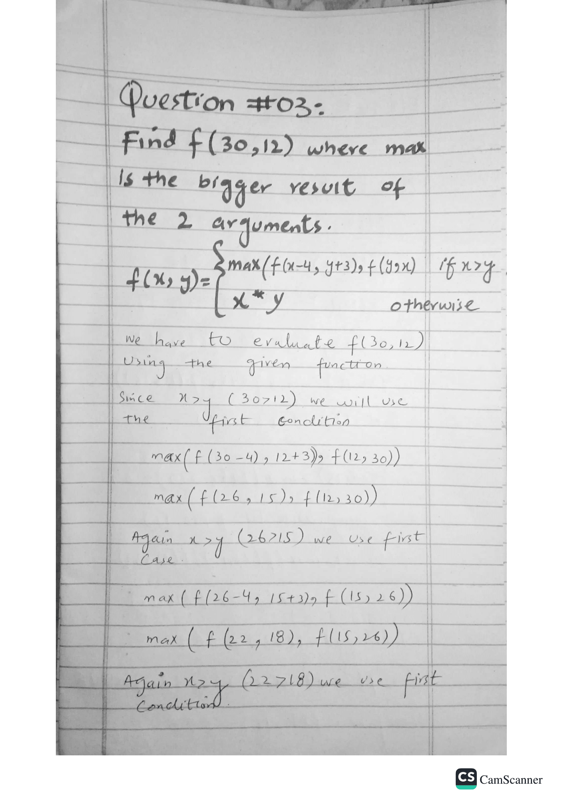
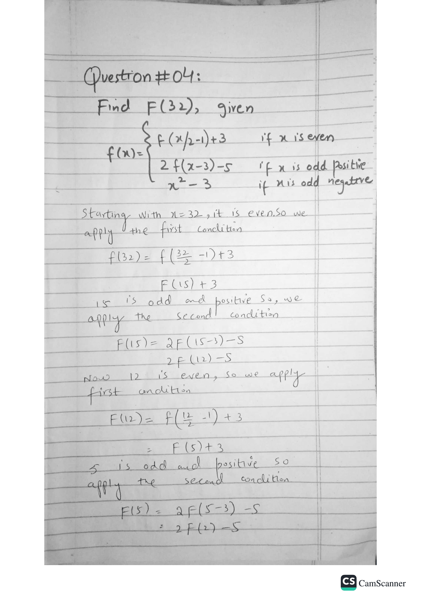
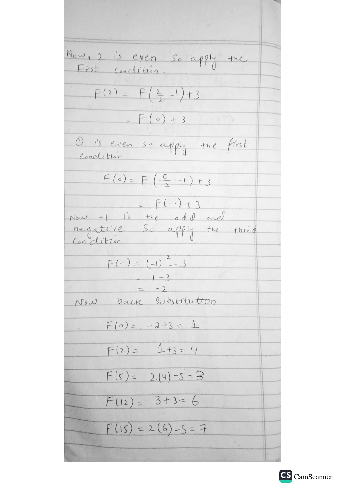
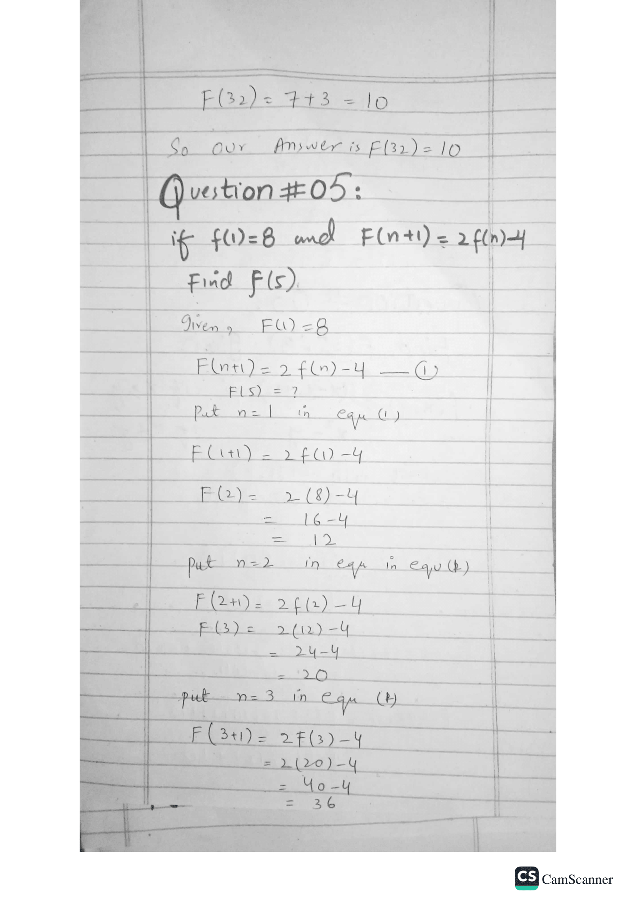
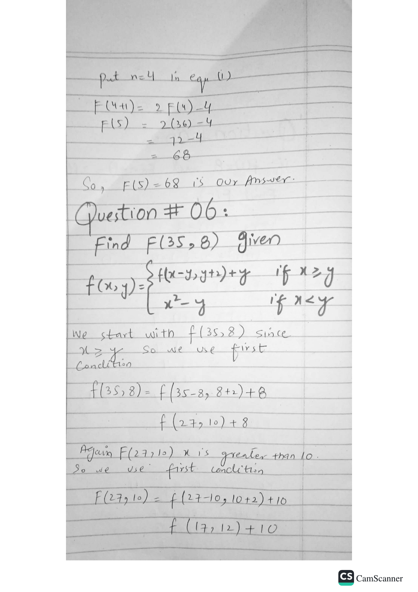
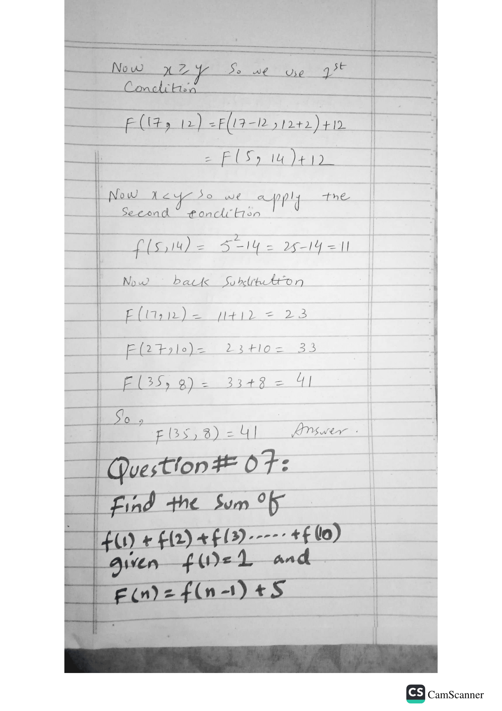
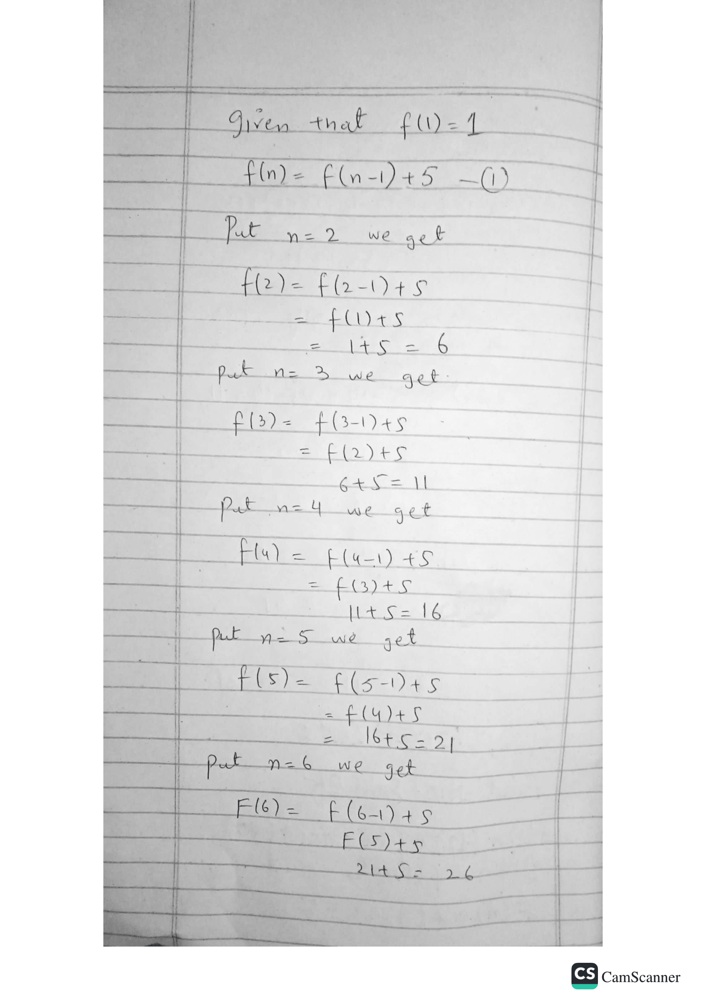
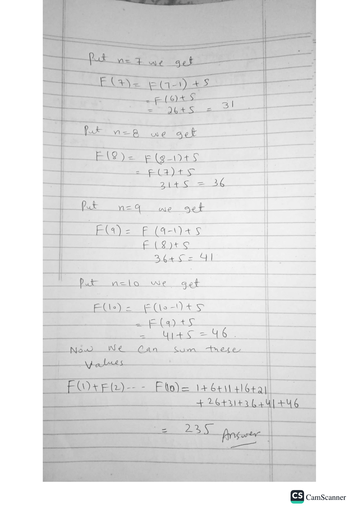
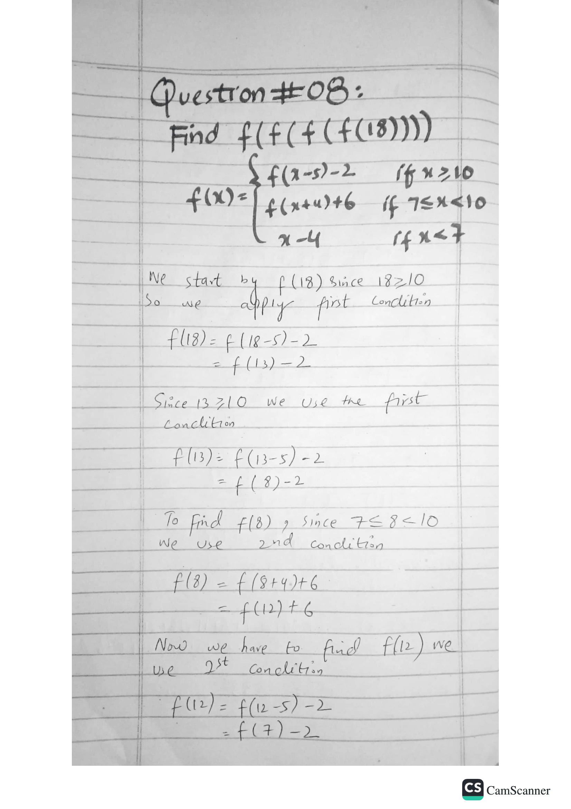
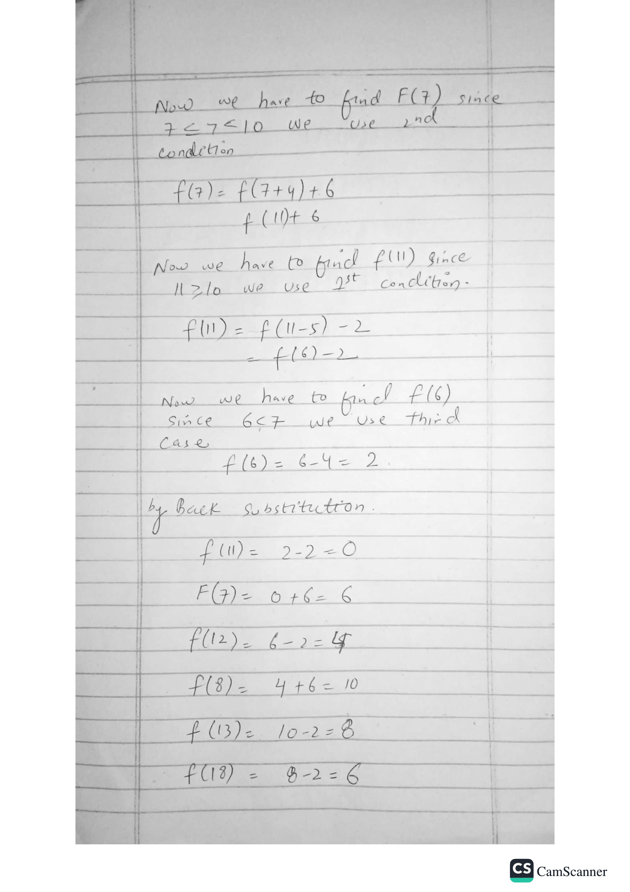
